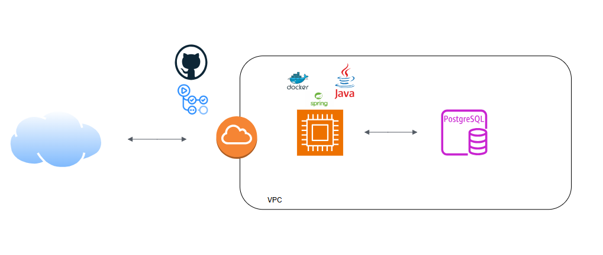
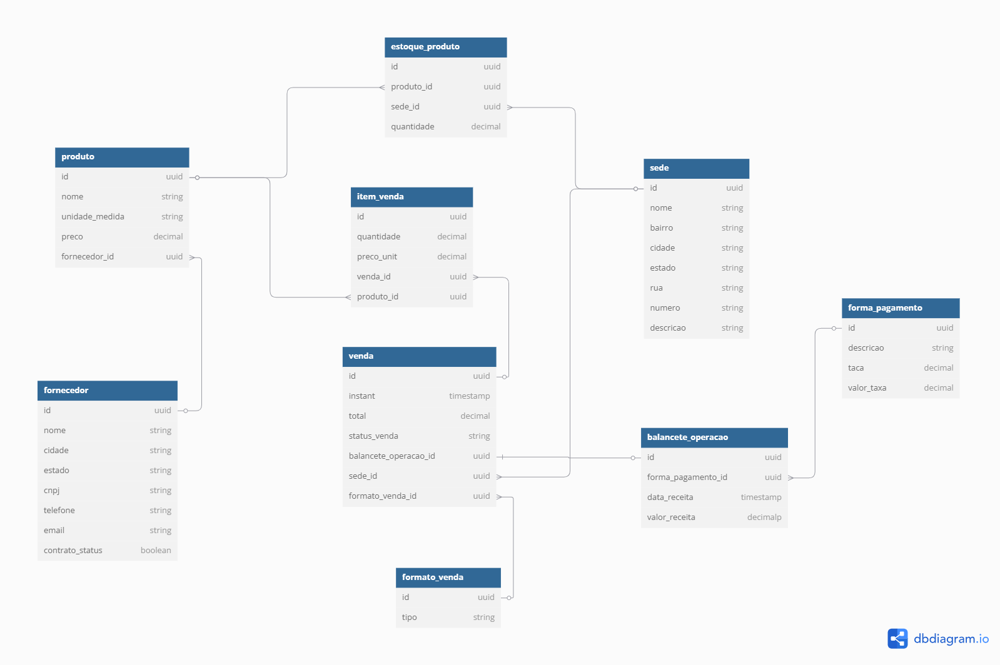

# 🍉 API de Processamento de Vendas e Pagamentos — Hortifruti Vale Verde

Este projeto tem como objetivo o desenvolvimento de uma API REST para registrar vendas e processar pagamentos de uma empresa fictícia  (**Hortifruti Vale Verde**), que atua em Belo Horizonte e região metropolitana, no estado de Minas Gerais.

A empresa possui múltiplas **sedes** e **fornecedores** espalhados pelo estado, com vendas realizadas tanto por **lojas físicas** quanto por **aplicativos mobile**.

A aplicação foi desenvolvida em **Java 17** utilizando **Spring Boot 3.4.5**, integrada ao banco de dados **PostgreSQL**. Todo o ecossistema é containerizado com **Docker** e orquestrado via **Docker Compose**, 
funcionando de forma consistente em ambientes de desenvolvimento e produção.

---

## ☁️ Arquitetura na AWS

A aplicação foi planejada para rodar em nuvem, com uma arquitetura baseada em serviços da **AWS** como EC2 e RDS.

  

---

## 🧠 Modelagem Lógica do Banco de Dados

A modelagem lógica contempla entidades como **Produto**, **Venda**, **Item de Venda**, **Cliente**, **Forma de Pagamento**, **Sede**, **Fornecedor**, entre outras, com chaves primárias baseadas em UUIDs e relacionamentos bem definidos.

  

---

## ✅ Tecnologias Utilizadas

- Java 17
- Spring Boot 3.4.5
- PostgreSQL
- Docker & Docker Compose
- AWS (EC2 e RDS)
- Jakarta Bean Validation
- Lombok
